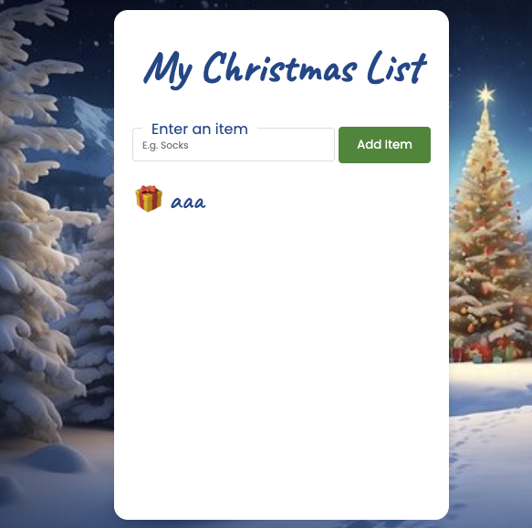

# Day 1 Grandpa's Gift List

## Challenge

Grandpa has a Christmas wish list to keep track of all the gifts he wants to ask for. But there’s a problem: if he forgets he’s already added something, the list gets clogged up with duplicates. This happened last year, and he ended up with 8 talking picture frames on Christmas Day!

Your task is to complete the `checkDuplicate()` function 👇 to ensure no duplicates are added to the list. But here’s the tricky part: Grandpa sometimes hits the spacebar more than once, making it harder to spot duplicates.

For example, only one of these entries should be added to the list — the others should be flagged as duplicates:

```js
"talking picture frames";
"talking  picture frames";
"talking picture    frames";
" talking picture frames ";
```

**Your tasks:**

1. Ensure no duplicates can be added to the list.
2. Account for extra spaces at the beginning/end and between words.

**Stretch Goals:**

1. Case Sensitivity: Handle cases where capitalization differs. For example:

   - `"Cat Hammock"` should be flagged as a duplicate of `"cat hammock"`.
   - Preserve Grandpa’s original capitalization (e.g., if `"Cat Hammock"` is added first, that should be added to the list). Do not simply convert all entries to lower case - Grandpa might well want to capitalize some words.

2. Additional Features: Add functionality to delete or edit items on the list.

## Solution

- [index.js](./index.js)

## References

### Regular Expression

### Special characters Class

- [Character classes](https://developer.mozilla.org/en-US/docs/Web/JavaScript/Guide/Regular_expressions/Character_classes)
- `[xyz][a-c]` - Characters class.
- `[^xyz][^a-c]` - Negated character class.
- `.` - Wildcard. Matches any single character
- `\d` - Digit character. Equivalent to [0-9].
- `\D` - Non-digit character. Equivalent to [^0-9]
- `\w` - Word character. Equivalent to [A-Za-z0-9_]
- `\W` - Non-word character. Equivalent to [^A-Za-z0-9_]
- `\s` - White space character.
- `\S` - Non-white space character.

### flag

- [Advanced searching with flags](https://developer.mozilla.org/en-US/docs/Web/JavaScript/Guide/Regular_expressions#advanced_searching_with_flags)

- `i` - Case-insensitive search.
- `g` - Global search. all occurrences of the pattern in the input string, rather than stopping after the first match.

## Array.includes()

- https://developer.mozilla.org/en-US/docs/Web/JavaScript/Reference/Global_Objects/Array/includes

```js
const array1 = [1, 2, 3];

console.log(array1.includes(2));

const pets = ["cat", "dog", "bat"];

console.log(pets.includes("cat")); //true
console.log(pets.includes("lion")); // false
```

## String.replace()

https://developer.mozilla.org/en-US/docs/Web/JavaScript/Reference/Global_Objects/String/replace

```js
const str = "Twas the night before Xmas...";
const newstr = str.replace(/xmas/i, "Christmas");
console.log(newstr); // Twas the night before Christmas...
```

```js
const str = "talking      picture    frames.";
const newstr = str.trim().replace(/\s+/g, " ");
console.log(str);
console.log(`newstr: ${newstr}`); // talking picture frames.
```

## Screenshot



## History

- 4/3/2025
